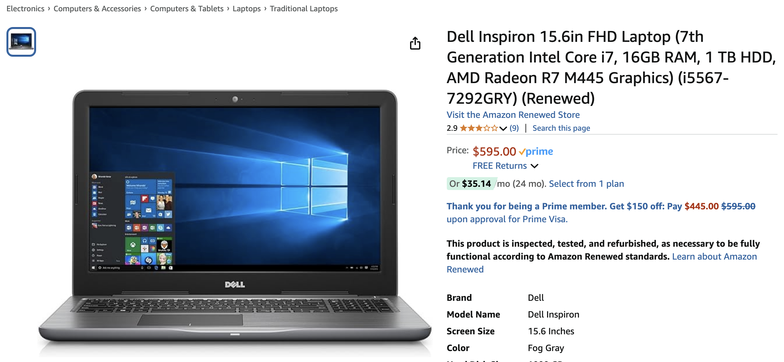
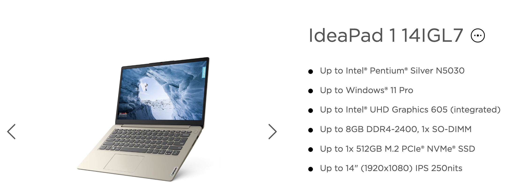
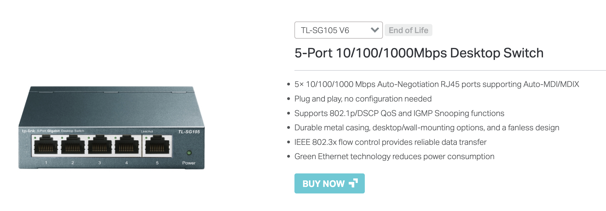
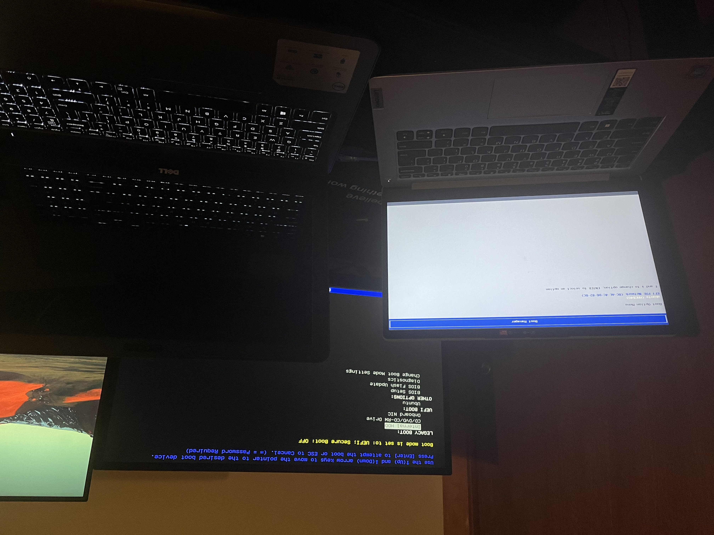
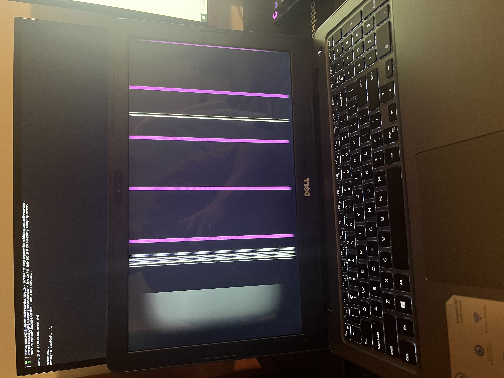
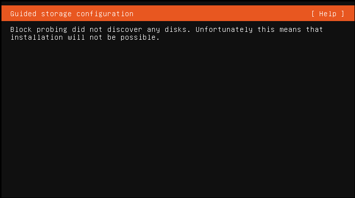
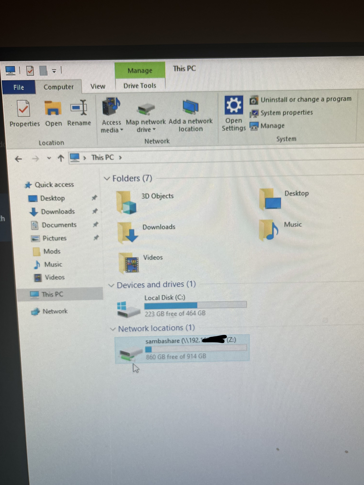

 
Hi, I'm Rodge!

Here I will document my journey in developing my very own Ubuntu servers! The purpose of this project is to develop hands-on experience with servers, Linux, networking, and relevant IT practices.

## To-Do 📝

- [x]  Get Dell(a) laptop to function
- [x]  Obtain network access for Lenovo laptop via ethernet adapter
- [x]  Install Ubuntu Server OS on both laptops
- [x]  Allow SSH access to servers providing centralized access at one point
    - [x]  Get remote access on phone via Terminus App
- [x]  Implement NAS capability for file storage via Samba
- [ ]  Run a home media server with Plex
- [ ]  Implement VPN to allow remote access to home server from anywhere
- [ ]  Support containerization with Docker
- [ ]  Learn virtualization with Proxmox

## Equipment ⚙️

- della (Primary Server)
    - **Model:** Inspiron 5567
    - **Processor:** Intel i7-7500U @ 3.5 GHz
    - **Storage:** 1 TB
    - **Memory:** 16 GB

     

- lennie (Secondary Server)
    - **Model:** IdeaPad 1 14IGL7
    - **Processor:** Intel Celeron N4020 @ 2.8 GHz
    - **Storage:** 512 GB
    - **Memory:** 4 GB

    

- TP-Link TL-SG105 5 Port Desktop Gigabit Switch
    
    
  
    

## Journey/Timeline 📅

### Day 0: Initial Setup 🎬

These were the first steps into establishing my own home servers. After researching for about a week regarding home labbing through Reddit and YouTube, I realized that it is very simple and cheap to actually run a server.

I see recommendations that you can just use old laptops to host your own servers and also uses less power a normal server or computer while providing power redundancy since it has its own laptop battery.

I went through my parent’s old stuff and found three old laptops they were not using! It was one Lenovo, one Dell, and one macbook pro. These things were really old like a decade old but I think just cleaning and wiping the data will be enough for some basic self-hosting stuff. The next thing I would need to do is just verify if they work. 

This was the first big issue I found with these laptops. The Dell computer seemed to be broken! Upon boot up the laptop screen flickers and vertical purple lines were appearing. I thought it was a lost cause at first but after taking a day to think about it, I wonder if it was only a display issue. So I brought the Dell laptop to my family computer and plugged the monitor into the laptop and BAM! It works! The only issue with the laptop seemed to be that it had a display issue probably from being dropped.

The Lenovo laptop was a lot easier which is because it was received recently from my dad but he no longer uses it. The only issue I found with it was that it had no ethernet port to allow wired network connection which I found to be an issue since I would rather it to have the fastest network connection as possible. So I think I will have to find an ethernet adapter from USB to allow wired connection.

Finally the Macbook Pro sadly was not able to bootup. I let the laptop charge for hours and it just would not power on. I did not take much time to figure why it does not work since I already had two laptops already so I just let that one go.

The final device I will need is a network switch to connect all these devices together and establish my very own home lab network. I went through facebook marketplace and found deals from $5 to $20 and even some for free! The only issue was finding the time to get these items since they are really far or only be able to pick it up during weekdays which is when I work. I settled for just purchasing a network switch from a local best buy which my girlfriend helped pay a portion for.

With all the equipment ready lets set up the network! 

### Day 1-2: Ubuntu Server Setup and pain 🤕

I was so happy to be able to get everything I needed for only under $20! I was able to also get some CAT6 cables from home and work, an USB for the Ubuntu server OS image, and a ethernet adapter.

I first started on the Dell laptop where I hooked my second monitor to it so that the display would work. I plugged the USB in, went to BIOS and bootup menu but the issue with this is that the monitor would not display the BIOS screen since it would only be displayed on the main screen which was the laptop display itself which was broken. After going through old forums and articles I found that you are able to change main displays with fn + f8 which worked perfectly! So I then started the imaging process. 

This would then start one of the most frustrating moments of my life. So everything seemed to boot up fine at first with everything loading and getting to the language setup menu, went through the basic configurations and then I hit a major roadblock. The server setup will try to discover disks on the laptop, do this for 5 minutes, and hit me with "Block probing did not discover any disks”. I was not sure on why that occurred so I went through forums. Some common ways to fix the issue was to ensure secure boot was OFF, turn RAID mode to AHCI, use legacy boot mode, use an older Ubuntu server OS version, and initialize pre-boot commands. All of these did not work but the pre-boot almost did. It would get me past the block probing error but then it would crash after formatting the drives.

I went through this entire troubleshooting process for hours. I spent an entire day trying to figure out why this block probing error kept occurring even until 2AM. I went even deeper into old forums. I tried literally everything I can throw at it: commands, settings, older versions, different versions, reinstalling the image 5 times. Nothing would work, none of these forum answers were any help at all.

I just decided to move on to the other laptop. I got the Lenovo and went through the imaging process. Everything went through perfectly. Once the Ubuntu server OS installed, I just had to get network connection. I plugged my ethernet adapter and ethernet cables in and pinged google.com. Nothing happens. Okay so now I am having a network and peripheral device issue with this laptop. I tried plugging and replugging and restarting, no network connection at all. Feeling defeated and frustrated I just gave up for the day for these two devices.

### Day 3: A Breakthrough. 🚀

Back to the Dell laptop, I was on the verge of giving up the entire project until I decided to one more thing. I had my work USB which contained a Windows 11 installer, with this I wondered if deleting the partitions and wiping the drive would help at all. So with nothing else to do I plugged my work USB instead and deleted all partitions associated with my laptop drive.

Once partitions were deleted, I restarted the laptop and booted to the Ubuntu server installer. Went through the basic configurations and then INSTANTLY went past the block probing screen which was a great sign since it normally took me 5 - 10 minutes to go through just to show a block probing error. I went through formatting the drives and immediately it started downloading and getting the server OS ready!

I WAS ECSTATIC. I spent 2 whole days until 2AM trying to get this to work. I felt so proud for being able to troubleshoot something that I was stuck on for days and with no real searchable answer anywhere. I got this old Dell laptop to work on my own! Once it finally booted up, it was ready to be used.

I moved on to the other Lenovo laptop. I brought another ethernet adapter from work just to see if maybe it was a driver compatibility issue. This time I made sure that it was compatible by searching the model and seeing that it was compatible with Linux so now I am sure it will work. I plugged the adapter and pinged [google.com](http://google.com) with no success.

I went through forums and found that I can verify if the interface was UP and if it was properly plugged in. The interface was down and it seemed that I can configure the network settings through netplan. After statically configuring the interface and rebooting, it worked!.

I now have 2 fully functioning Ubuntu servers! 

### Day 4-6: Installing applications and general configurations 🥳

Since I am able to get these two servers working I decided to give these two devices names. My primary server, the Dell laptop will be named della to handle main storage and heavy load matters. My secondary server, the lenovo will be named lennie for any additional space or for experimenting before applying to della.

I did some basic network configurations with both servers to have their own static IPs so their IPs are not dynamically set by reserving their IPs through router settings and editing their netplan yaml configuration files.

The first thing I got running was Samba for NAS, I plan to use this storage for my phone photo storage since my IPhone is reaching max capacity and photos and videos are taking a lot of space. I had some issues getting it to work since I confused where the configuration file was suppose to go but I eventually was able to get it working!

The next thing was trying to get Plex to work. After some researching I decided to instead install docker first and containerize Plex with docker since it will be easier to manage and it is simpler to download.
